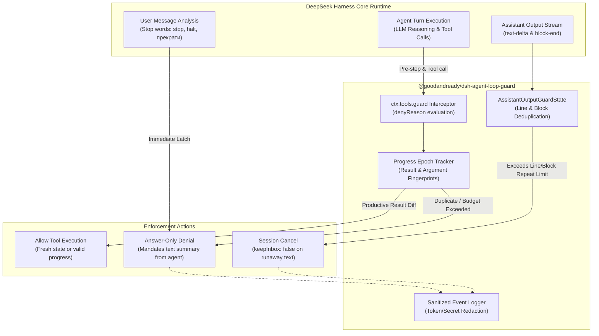

# 📦 @goodandready/dsh-agent-loop-guard

<div align="center">

<h3>Fail-Closed Runtime Tool-Call & Assistant Output Loop Breaker for DeepSeek Harness</h3>

<p align="center">
  <a href="https://www.npmjs.com/package/@goodandready/dsh-agent-loop-guard"></a>
  <a href="LICENSE"></a>
  <a href="https://github.com/topics/dsh-plugin"></a>
  <a href="https://nodejs.org"></a>
</p>

<p align="center">
  <a href="https://goodandready.app/"></a>
</p>

<p align="center">
  <a href="README.md"><b>🇬🇧 English</b></a> •
  <a href="README.ru.md"><b>🇷🇺 Русский</b></a> •
  <a href="README.zh.md"><b>🇨🇳 中文说明</b></a>
</p>

<table align="center">
  <tr>
    <td align="center">
      ⭐ <strong>If you like this plugin, please star it on GitHub</strong> — it shows me that the plugin is useful to you and motivates me to keep developing it.
      <br><br>
      🐛 <strong>If you find a bug or would like to request a feature</strong>, open a GitHub issue in any language — I will review your proposal and implement useful suggestions in a future plugin version.
    </td>
  </tr>
</table>

</div>

---

## ⚡ Overview & Problem Solved

When autonomous AI coding agents encounter unexpected tool failures, ambiguous instructions, or hallucination loops, they often enter infinite retry cycles — repeatedly reading the same directory, editing identical lines without progress, or echoing identical output lines across streaming turns. These loops rapidly exhaust token budgets, lock execution threads, and waste API credits without ever completing user goals.

**`@goodandready/dsh-agent-loop-guard`** is a native host runtime plugin for DeepSeek Harness that intercepts and breaks loops before they spiral out of control:

1. **Progress-Aware Tool-Call Guard**: Employs epoch-based state tracking so that repeated calls are blocked *only* when no meaningful state changes or new evidence appear. Legitimate productive iterations (e.g. `read` ➔ `edit` ➔ `read` ➔ `edit`) remain fully unrestricted.
2. **Assistant Output Loop Breaker**: Detects text-only repetition (identical streaming lines or multi-line markdown blocks) across turns and steps, cleanly canceling runaway generation without damaging session history.
3. **Answer-Only Graceful Fallback**: Instead of terminating abruptly, the plugin triggers structured DSH denials that guide the LLM into answering with text explaining the bottleneck.
4. **Zero Core Modifications**: Implemented purely through Cordis lifecycle hooks (`ctx.tools.guard`, `agent/pre-step`, `tools/execute`, `session/event`).

---

## 🏗️ Architecture



---

## ✨ Full Feature Breakdown

### 1. Progress-Aware Tool Execution Tracking

Unlike naive counters that blindly limit tool invocations, `dsh-agent-loop-guard` distinguishes between **productive iteration** and **stagnant loops**:

* **Canonical Fingerprinting**: Creates deterministic JSON signatures of tool arguments (`callFingerprint`) and results (`resultFingerprint`).
* **Progress Epochs**: When an edit or command yields a different result, the session transitions to a new progress epoch, resetting the failure budget.
* **Granular HTTP/VCS Safety**: Distinct endpoints and HTTP methods (e.g., Gitea API operations or curl scripts) are never collapsed under a shared base URL.
* **Progress Tool Whitelist**: Designated progress tools (`todo_write`, etc.) maintain independent no-progress budgets so task checklists do not trigger false positives.

### 2. Guard Violation Codes & Enforcement Modes

When a loop is detected, the guard rejects the call with structured diagnostics and enforces **Answer-Only Mode** for the rest of the turn:

| Guard Code | Trigger Condition | Default Limit | Guard Action |
|:---|:---|:---|:---|
| `LOOP_GUARD_STOP` | User sent stop command (`stop`, `halt`, `cancel`, `остановись`, `прекрати`, `ответь`, `петля`) | Immediate | Rejects tool call; requires immediate text reply |
| `LOOP_GUARD_DUPLICATE` | Identical call arguments with identical result to previous attempt | 1 retry | Blocks exact repeat; demands alternative approach |
| `LOOP_GUARD_REPEAT` | Repeated calls within current group without state change | `maxCallsPerRepeatGroup` (5) | Prevents spinning on single tool |
| `LOOP_GUARD_LIMIT` | Total non-productive tool attempts since last successful progress | `maxToolAttemptsPerTurn` (64) | Caps turn exploratory budget |
| `LOOP_GUARD_PROGRESS_LIMIT` | Successive invocations of progress tools without content changes | `maxProgressToolCallsPerTurn` (16) | Prevents infinite todo-writing loops |
| `LOOP_GUARD_OUTPUT` | Assistant generated identical lines or multi-line blocks | `maxRepeatedAssistantLines` (5) | Cancels session cleanly via `agent.cancel()` |

### 3. Assistant Output Stream Guard

Runaway LLM generation can manifest as repetitive narration without tool calls. The output guard monitors streaming text in real time:

* **Line Normalization**: Collapses carriage returns and whitespace to catch formatted repetition.
* **Multi-Line Block Detection**: Hashes blocks up to `maxAssistantBlockChars` (16,384 bytes) to detect cyclical paragraph generation.
* **Active Tool Immunity**: While tool calls are executing, output cancellation is temporarily suppressed to avoid false alarms during long tasks.
* **Lossless Deduplication**: Cleanses streaming chunks and message buffers without losing valid context.

### 4. Enterprise Privacy & Token Redaction

All loop guard warning logs automatically redact sensitive credentials:
* Bearer tokens, passwords, cookies, and query parameter secrets (`token=`, `api-key=`, `secret=`) are replaced with `[redacted]` before reaching logs.
* Deeply nested argument trees are bounded to prevent memory leaks during massive JSON payloads.

---

## 📦 Installation

Install via DeepSeek Harness CLI:

```bash
dsh plugin --profile web add @goodandready/dsh-agent-loop-guard
```

Restart DSH Web UI and reload your workspace.

---

## ⚙️ Configuration

Configure via `config.yaml` or through the Web UI settings:

```yaml
# config.yaml
dsh-agent-loop-guard:
  maxToolAttemptsPerTurn: 64
  maxProgressToolCallsPerTurn: 16
  progressToolNames:
    - todo_write
  maxCallsPerRepeatGroup: 5
  blockExactDuplicates: true
  assistantOutputGuard: true
  maxRepeatedAssistantLines: 5
  maxRepeatedAssistantBlocks: 5
  maxAssistantBlockChars: 16384
```

### Settings Reference Table

| Key | Type | Default | Description |
|:---|:---|:---|:---|
| `maxToolAttemptsPerTurn` | `number` | `64` | Maximum un-productive tool attempts allowed before forcing an answer. Set to `0` to disable aggregate budget. |
| `maxProgressToolCallsPerTurn` | `number` | `16` | Maximum consecutive calls to progress tools (`todo_write`) without substantive progress. |
| `progressToolNames` | `array` | `["todo_write"]` | Array of tool names considered progress markers. |
| `maxCallsPerRepeatGroup` | `number` | `5` | Maximum tool calls allowed within the same repeat group without producing a new result. |
| `blockExactDuplicates` | `boolean` | `true` | Immediately block consecutive identical calls with zero state change. |
| `assistantOutputGuard` | `boolean` | `true` | Enable real-time detection and cancellation of repetitive assistant output loops. |
| `maxRepeatedAssistantLines` | `number` | `5` | Threshold of consecutive identical output lines to trigger session cancellation. |
| `maxRepeatedAssistantBlocks` | `number` | `5` | Threshold of repeated multi-line markdown blocks before aborting generation. |
| `maxAssistantBlockChars` | `number` | `16384` | Maximum byte length captured for block fingerprinting. |

---

## 🧪 Testing & Verification

Run the full automated test suite covering all loop denial paths, streaming output guards, and progress epochs:

```bash
npm test
npm run check
```

---

## 📄 License

MIT © [GooDAnDReaDY](https://github.com/GooDAnDReaDY)

## Changed in v0.2.4

- **Settings UI**: allow saving `0` for `maxToolAttemptsPerTurn` to cleanly disable aggregate turn budget (#28).
- **Outcome Analysis**: recognize `{ error: null }` and `{ error: false }` as non-failures in execution outcome evaluation (#28).
- **Alternating Loop Breaker**: track prior results per tool fingerprint (`state.lastResults`) to block alternating non-productive loops (A ➔ B ➔ A ➔ B) (#28).
- **Settings Card**: add reactive `settings.plugin.item` card in DSH Settings with live configuration updates (#26).
- **Test Suite**: expanded to 31 automated tests covering error edge cases and alternating loop enforcement (#28).
