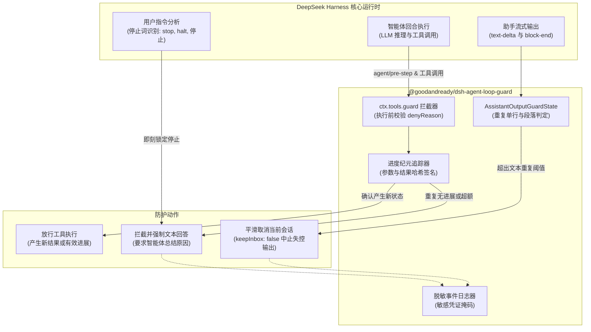

# 📦 @goodandready/dsh-agent-loop-guard

<div align="center">

<h3>面向 DeepSeek Harness 的工具调用与智能体流式输出死循环熔断引擎</h3>

<p align="center">
  <a href="https://www.npmjs.com/package/@goodandready/dsh-agent-loop-guard"></a>
  <a href="LICENSE"></a>
  <a href="https://github.com/topics/dsh-plugin"></a>
  <a href="https://nodejs.org"></a>
</p>

<p align="center">
  <a href="https://goodandready.app/"></a>
</p>

<p align="center">
  <a href="README.md"><b>🇬🇧 English</b></a> •
  <a href="README.ru.md"><b>🇷🇺 Русский</b></a> •
  <a href="README.zh.md"><b>🇨🇳 中文说明</b></a>
</p>

<table align="center">
  <tr>
    <td align="center">
      ⭐ <strong>如果您喜欢这个插件，请在 GitHub 上为它点亮 Star</strong> — 这能让我知道插件对您有用，并鼓励我继续开发和维护它。
      <br><br>
      🐛 <strong>如果您发现 Bug 或希望增加功能</strong>，请使用任意语言在 GitHub 上提交 Issue — 我会评估您的建议，并在后续版本中实现有价值的改进。
    </td>
  </tr>
</table>

</div>

---

## ⚡ 核心定位与解决痛点

在自主 AI 智能体执行复杂多阶段研发任务时，遇到工具调用异常、指令模糊或模型幻觉时，极易陷入无限重试死循环：反复读取同一文件、以完全相同的参数反复调用工具却无实际产出，或在流式输出中无限重复相同的文本。此类死循环不仅迅速耗尽上下文 Token 预算，还会导致 UI 卡死与 API 额度浪费。

**`@goodandready/dsh-agent-loop-guard`** 是专为 DeepSeek Harness 打造的原生宿主运行时防死循环熔断插件，无需修改 DSH 核心代码即可提供全面防护：

1. **进度感知型工具防循环（Progress-Aware Epochs）**：仅在工具调用未产生任何状态变化或新证据时判定为死循环。合法的有效迭代（如 `读` ➔ `写` ➔ `读` ➔ `写`）完全不受限制。
2. **文本输出流防死循环（Assistant Output Guard）**：实时监测智能体流式输出，精准识别跨回合或跨步骤的单行及多行 Markdown 段落重复，安全中断生成而不破坏历史对话。
3. **平滑降级至仅回答模式（Answer-Only Mode）**：触发死循环拦截时，向模型返回结构化 DSH 拒绝信息，强制要求模型输出文本向用户说明当前遇到的瓶颈。
4. **日志隐私脱敏**：所有安全警告日志自动对 Token、密码、API Key 等敏感数据进行 `[redacted]` 掩码处理。

---

## 🏗️ 架构设计



---

## ✨ 核心特性深度解析

### 1. 进度感知型工具调用判定

与盲目统计调用次数的简单计数器不同，本插件精准区分**有效迭代**与**停滞循环**：

* **确定性指纹签名**：为调用参数（`callFingerprint`）与返回结果（`resultFingerprint`）生成确定性 JSON 指纹。
* **进度纪元追踪（Progress Epochs）**：一旦操作产生新证据（如文件修改成功、返回新差异或进度 Token），无进展计数器立即重置。
* **网络与 VCS 细粒度隔离**：不同的 HTTP 端点或请求方法（如 Gitea API 的不同资源操作）绝不会因基础域名相同而发生误判。
* **进度工具独立白名单**：专用于维护任务清单的工具（如 `todo_write`）拥有独立的无进展预算，避免更新进度时误触拦截。

### 2. 拦截代码速查与触发策略

| 拦截代码 | 触发场景 | 默认阈值 | 防护动作 |
|:---|:---|:---|:---|
| `LOOP_GUARD_STOP` | 用户发送了终止或要求回答的指令（`stop`, `halt`, `cancel`, `停止`, `等等`, `回答`） | 立即触发 | 拦截后续工具调用，强制智能体立即返回文本答复 |
| `LOOP_GUARD_DUPLICATE` | 连续以完全相同参数调用工具且返回结果毫无变化 | 1 次重复 | 阻止原地踏步，强制更换执行策略 |
| `LOOP_GUARD_REPEAT` | 同一工具组在未产生新状态的情况下连续重复调用 | `maxCallsPerRepeatGroup` (5) | 防止单一工具过度空转 |
| `LOOP_GUARD_LIMIT` | 当前回合自上次产出有效进展以来的总无效调用次数超标 | `maxToolAttemptsPerTurn` (64) | 限制单回合探索预算上限 |
| `LOOP_GUARD_PROGRESS_LIMIT` | 连续调用进度工具而未产生任何任务变更 | `maxProgressToolCallsPerTurn` (16) | 防止陷入无限修改清单死循环 |
| `LOOP_GUARD_OUTPUT` | 智能体在流式输出中重复输出相同单行或完整段落 | `maxRepeatedAssistantLines` (5) | 通过 `agent.cancel()` 安全中断当前输出 |

### 3. 流式文本防死循环机制

* **行规范化**：自动剔除多余空格与不可见回车符，精准捕获带格式的文本重复。
* **段落哈希**：支持最长 `maxAssistantBlockChars` (16,384 字节) 的多行 Markdown 块哈希比对。
* **长耗时工具豁免**：在工具实际执行期间，文本中断检测自动保持静默，避免长任务被误杀。
* **用户输入无损重置**：用户发起新对话轮次时，检测状态自动全量清理重置。

---

## 📦 快速安装

通过 DeepSeek Harness CLI 一键安装：

```bash
dsh plugin --profile web add @goodandready/dsh-agent-loop-guard
```

重启 DSH 并刷新浏览器工作区。

---

## ⚙️ 配置指南

在 `config.yaml` 或 Web UI 设置面板中配置：

```yaml
# config.yaml
dsh-agent-loop-guard:
  maxToolAttemptsPerTurn: 64
  maxProgressToolCallsPerTurn: 16
  progressToolNames:
    - todo_write
  maxCallsPerRepeatGroup: 5
  blockExactDuplicates: true
  assistantOutputGuard: true
  maxRepeatedAssistantLines: 5
  maxRepeatedAssistantBlocks: 5
  maxAssistantBlockChars: 16384
```

### 配置参数参考表

| 参数名 | 类型 | 默认值 | 功能说明 |
|:---|:---|:---|:---|
| `maxToolAttemptsPerTurn` | `number` | `64` | 单回合最大无进展工具调用预算。设为 `0` 可禁用此聚合上限。 |
| `maxProgressToolCallsPerTurn` | `number` | `16` | 进度标记工具（`todo_write`）连续无进展调用的上限。 |
| `progressToolNames` | `array` | `["todo_write"]` | 标记任务进度的工具名称数组。 |
| `maxCallsPerRepeatGroup` | `number` | `5` | 同一组工具未产生新结果时允许调用的最大次数。 |
| `strictTools` | `array` | `[]` | 受到更严格重复调用限制的敏感/修改类工具名称列表。 |
| `strictToolLimit` | `number` | `3` | `strictTools` 列表中工具的最大允许重复次数。 |
| `blockExactDuplicates` | `boolean` | `true` | 是否立即拦截结果毫无变化的连续相同调用。 |
| `dryRunMode` | `boolean` | `false` | 审计模式：记录告警与遥测指标，但不实际拦截工具调用。 |
| `assistantOutputGuard` | `boolean` | `true` | 是否开启助手流式文本输出防死循环监测。 |
| `maxRepeatedAssistantLines` | `number` | `5` | 触发输出中断的连续相同单行阈值。 |
| `maxRepeatedAssistantBlocks` | `number` | `5` | 触发输出中断的连续重复段落阈值。 |
| `maxAssistantBlockChars` | `number` | `16384` | 捕获用于段落指纹比对的最大字符数。 |

---

## 🧪 测试与校验
 
运行全部 37 个自动化单元测试及静态代码检查：
 
```bash
npm test
npm run check
```
 
---
 
## 📄 开源许可证
 
MIT © [GooDAnDReaDY](https://github.com/GooDAnDReaDY)
 
---
 
## v0.2.7 更新日志

- **延迟插槽注入机制**：使用 `registerSlotWhenReady` 与 `ctx.slots.inject` 包装 `settings.plugin.item` 注册逻辑，防止插件在浏览器前端初始化时因插槽未提前声明而抛出 `slot "settings.plugin.item" is not declared` 崩溃异常 (#33)。
- **插槽规范对齐**：根据 `dsh-plugin-authoring` 标准，将插槽注册参数调整为 `key: NS` 并注入 `inject: () => ({ ctx })` (#33)。
- **客户端自动化测试**：扩展 `test/client.test.js`，全面验证插槽延迟注入逻辑与缺失回退机制 (#33)。

## v0.2.6 更新日志

- **浏览器 ModuleLoader 导入修复**：在 `lib/client.js` 的 factory 函数中显式声明 `var exports = module.exports;`，彻底修复 DSH 网页端 ModuleLoader 动态加载时抛出的 `ReferenceError: exports is not defined` 异常 (#31)。
- **客户端测试用例**：新增 `test/client.test.js`，通过 Node.js VM 模拟浏览器端模块加载环境并自动化验证 (#31)。

## v0.2.5 更新日志

- **一键平滑更新**：集成宿主端更新器（`lib/plugin-updater.js`），提供 `/api/@goodandready/dsh-agent-loop-guard/update` 接口与设置界面更新状态/按钮 (#29)。
- **敏感工具严格配额**：新增 `strictTools` 与 `strictToolLimit` 配置，强化对高危/文件修改工具的重复调用限制 (#29)。
- **审计模式 (Dry-Run)**：新增 `dryRunMode` 配置，支持在不阻断智能体调用的前提下记录告警与度量数据 (#29)。
- **防护遥测与监控**：实时统计拦截指标（`LOOP_GUARD_DUPLICATE`, `LOOP_GUARD_REPEAT`, `LOOP_GUARD_LIMIT`, `LOOP_GUARD_OUTPUT`），提供 `/api/@goodandready/dsh-agent-loop-guard/telemetry` 接口与一键重置 (#29)。
- **LLM 智能恢复引导**：在拦截消息中为 DeepSeek-R1 / V3 等模型提供结构化的破局指导与操作建议 (#29)。
- **严格多语言规范**：代码库仅保留标准英文（`en`）与中文（`zh`），俄语本地化转入 Issue #197 (`goodandready/dsh-russian-lang`) 处理 (#29)。
- **设计契约**：按照 `project-design-contract` 标准建立 `docs/design/DESIGN.md` (#29)。
- **扩展自动化测试**：总测试用例扩充至 37 个，涵盖更新器语义版本、请求安全性、严格工具配额与审计模式 (#29)。

## v0.2.4 更新日志
 
- **设置界面**：修复 `maxToolAttemptsPerTurn` 保存为 `0` 的问题，允许正常禁用单回合工具调用上限 (#28)。
- **结果解析**：对象中的 `{ error: null }` 与 `{ error: false }` 正确识别为非错误，不再阻碍进展推进 (#28)。
- **交替循环拦截**：通过 `state.lastResults` 跟踪每个工具的先前结果，有效拦截无实质进展的交替循环调用 (A ➔ B ➔ A ➔ B) (#28)。
- **设置卡片**：集成标准 `settings.plugin.item` 配置卡片，支持动态热重载 (#26)。
- **测试用例**：自动化测试扩展至 31 个测试。
