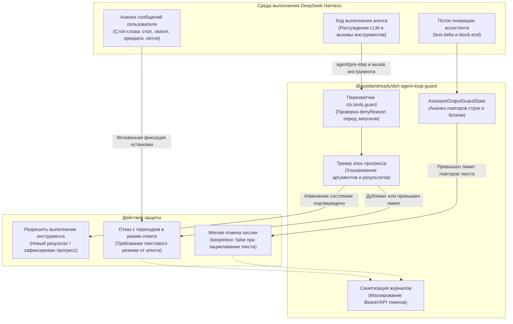

# 📦 @goodandready/dsh-agent-loop-guard

<div align="center">

<h3>Аварийный предохранитель от зацикливания вызовов инструментов и текстового потока агента для DeepSeek Harness</h3>

<p align="center">
  <a href="https://www.npmjs.com/package/@goodandready/dsh-agent-loop-guard"></a>
  <a href="LICENSE"></a>
  <a href="https://github.com/topics/dsh-plugin"></a>
  <a href="https://nodejs.org"></a>
</p>

<p align="center">
  <a href="https://goodandready.app/"></a>
</p>

<p align="center">
  <a href="../README.md"><b>🇬🇧 English</b></a> •
  <a href="README.ru.md"><b>🇷🇺 Русский</b></a> •
  <a href="README.zh.md"><b>🇨🇳 中文说明</b></a>
</p>

</div>

---

## ⚡ Назначение и решаемая проблема

При выполнении многоэтапных задач автономные ИИ-агенты могут попадать в петли повторных попыток: бесконечно перечитывать один и тот же файл без изменений, раз за разом безуспешно вызывать инструмент с одними и теми же параметрами или повторять одинаковые строки в потоковом ответе. Такие зацикливания приводят к мгновенному исчерпанию контекста и токенов, заморозке интерфейса и бесполезной трате бюджета.

**`@goodandready/dsh-agent-loop-guard`** — нативный плагин для среды выполнения DeepSeek Harness, предотвращающий зацикливание агента на уровне хоста без вмешательства в ядро DSH:

1. **Контроль прогресса инструментов (Progress-Aware Epochs)**: повторные вызовы инструментов блокируются *только тогда*, когда с прошлой попытки не изменилось состояние системы или результат. Легитимные продуктивные циклы (например, `чтение` ➔ `правка` ➔ `чтение` ➔ `правка`) выполняются абсолютно свободно.
2. **Предохранитель генерации текста (Assistant Output Loop Guard)**: отслеживает повторение отдельных строк и целых многострочных абзацев между шагами и ходами, выполняя мягкую отмену генерации без потери истории диалога.
3. **Безопасный переход в режим ответа (Answer-Only Mode)**: при фиксации зацикливания инструмент не просто падает с ошибкой, а возвращает структурированный отказ, обязывающий модель сформулировать текстовый ответ пользователю с объяснением проблемы.
4. **Маскирование секретов в журналах**: любые ключи доступа, токены и пароли автоматически заменяются на `[redacted]` в диагностических логах.

---

## 🏗️ Архитектура работы



---

## ✨ Подробный разбор возможностей

### 1. Эпохи прогресса и дифференциация вызовов

В отличие от примитивных счётчиков, плагин анализирует реальную полезность действий агента:

* **Детерминированные отпечатки**: строит стабильные сигнатуры аргументов (`callFingerprint`) и результатов вызовов (`resultFingerprint`).
* **Эпохи полезного действия**: как только вызов приводит к новому результату (изменился файл, вернулся новый diff или токен прогресса), счётчик холостых попыток обнуляется.
* **Изоляция сетевых операций**: различные методы и эндпоинты (например, разные API-запросы Gitea или curl) не склеиваются по общему базовому URL.
* **Белый список инструментов отслеживания задач**: инструменты ведения списков задач (`todo_write`) обладают собственным независимым бюджетом, предотвращая ложные срабатывания при обновлении чек-листов.

### 2. Коды нарушений и реакции предохранителя

| Код защиты | Условие срабатывания | Лимит по умолчанию | Действие плагина |
|:---|:---|:---|:---|
| `LOOP_GUARD_STOP` | Пользователь отправил команду остановки (`стоп`, `хватит`, `прекрати`, `ответь`, `петля`, `stop`, `halt`, `cancel`) | Мгновенно | Блокирует вызовы инструментов; требует немедленный текстовый ответ |
| `LOOP_GUARD_DUPLICATE` | Повторный вызов с идентичными аргументами и неизменным результатом | 1 повтор | Пресекает топтание на месте; требует сменить подход |
| `LOOP_GUARD_REPEAT` | Череда вызовов инструментов одной группы без изменения состояния | `maxCallsPerRepeatGroup` (5) | Останавливает монотонные повторы |
| `LOOP_GUARD_LIMIT` | Суммарное число бесплодных попыток за текущий ход | `maxToolAttemptsPerTurn` (64) | Ограничивает общий бюджет холостых действий |
| `LOOP_GUARD_PROGRESS_LIMIT` | Повторные вызовы progress-инструментов без реального продвижения | `maxProgressToolCallsPerTurn` (16) | Блокирует бесконечную перезапись todo |
| `LOOP_GUARD_OUTPUT` | Модель генерирует одинаковые строки или блоки текста | `maxRepeatedAssistantLines` (5) | Мягко прерывает сессию через `agent.cancel()` |

### 3. Предотвращение зацикливания текстового вывода

Иногда модель зацикливается не на инструментах, а на генерации текста (повторяет одну фразу в цикле streaming):

* **Нормализация строк**: очищает невидимые символы переноса и множественные пробелы.
* **Детекция абзацев**: хэширует блоки текста до `maxAssistantBlockChars` (16 384 байт).
* **Иммунитет во время выполнения инструментов**: пока агент ждёт завершения длительной команды, отмена текста временно блокируется.
* **Чистый сброс**: при отправке нового сообщения пользователем состояние детектора полностью очищается.

---

## 📦 Установка

Установка через командную строку DeepSeek Harness:

```bash
dsh plugin --profile web add @goodandready/dsh-agent-loop-guard
```

Перезапустите DSH и обновите вкладку браузера.

---

## ⚙️ Конфигурация

Настройка через файл `config.yaml` или панель управления DSH:

```yaml
# config.yaml
dsh-agent-loop-guard:
  maxToolAttemptsPerTurn: 64
  maxProgressToolCallsPerTurn: 16
  progressToolNames:
    - todo_write
  maxCallsPerRepeatGroup: 5
  blockExactDuplicates: true
  assistantOutputGuard: true
  maxRepeatedAssistantLines: 5
  maxRepeatedAssistantBlocks: 5
  maxAssistantBlockChars: 16384
```

### Таблица параметров конфигурации

| Параметр | Тип | По умолчанию | Описание |
|:---|:---|:---|:---|
| `maxToolAttemptsPerTurn` | `number` | `64` | Максимум холостых вызовов за ход. Значение `0` отключает суммарный бюджет. |
| `maxProgressToolCallsPerTurn` | `number` | `16` | Максимум вызовов progress-инструментов (`todo_write`) подряд без изменений. |
| `progressToolNames` | `array` | `["todo_write"]` | Список имён инструментов, маркирующих прогресс задач. |
| `maxCallsPerRepeatGroup` | `number` | `5` | Максимум повторений инструментов одной группы без смены результата. |
| `blockExactDuplicates` | `boolean` | `true` | Немедленно блокировать повторные идентичные вызовы без изменения состояния. |
| `assistantOutputGuard` | `boolean` | `true` | Включить мониторинг зацикливания текстового потока модели. |
| `maxRepeatedAssistantLines` | `number` | `5` | Порог повторяющихся одинаковых строк текста для прерывания генерации. |
| `maxRepeatedAssistantBlocks` | `number` | `5` | Порог повторяющихся многострочных блоков до отмены хода. |
| `maxAssistantBlockChars` | `number` | `16384` | Максимальный размер текстового блока для хэширования (в байтах). |

---

## 🧪 Тестирование
 
Запуск набора из 31 автоматизированного теста и статической проверки типов:
 
```bash
npm test
npm run check
```
 
---
 
## 📄 Лицензия
 
MIT © [GooDAnDReaDY](https://github.com/GooDAnDReaDY)
 
---
 
## Изменения в версии v0.2.4
 
- **Интерфейс настроек**: исправлено сохранение `0` для `maxToolAttemptsPerTurn` — теперь общий лимит попыток можно отключить через карточку плагина (#28).
- **Анализ результатов**: возвращаемые объектами поля `{ error: null }` и `{ error: false }` больше не считаются ошибками и не блокируют продвижение эпохи (#28).
- **Защита от чередующихся циклов**: добавлено отслеживание результатов по каждому инструменту (`state.lastResults`), исключающее зацикливание агента вида A ➔ B ➔ A ➔ B без изменения состояния (#28).
- **Карточка настроек**: внедрена стандартная карточка `settings.plugin.item` с динамическим обновлением параметров на лету (#26).
- **Набор тестов**: расширен до 31 автоматизированного теста.
